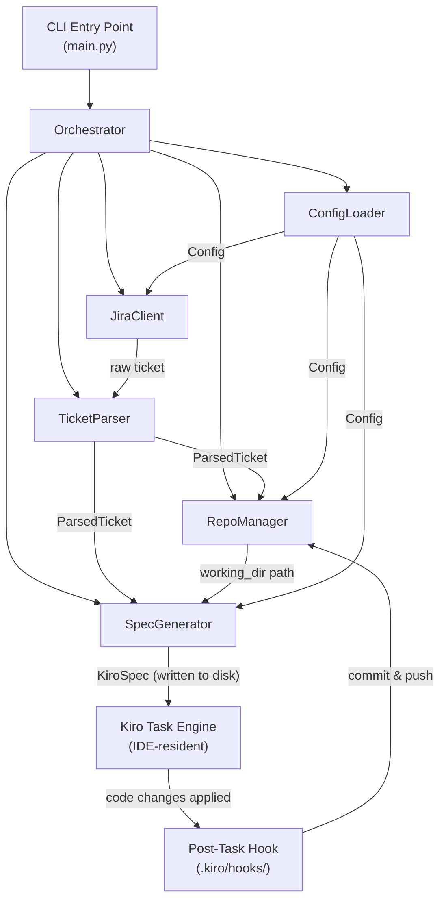
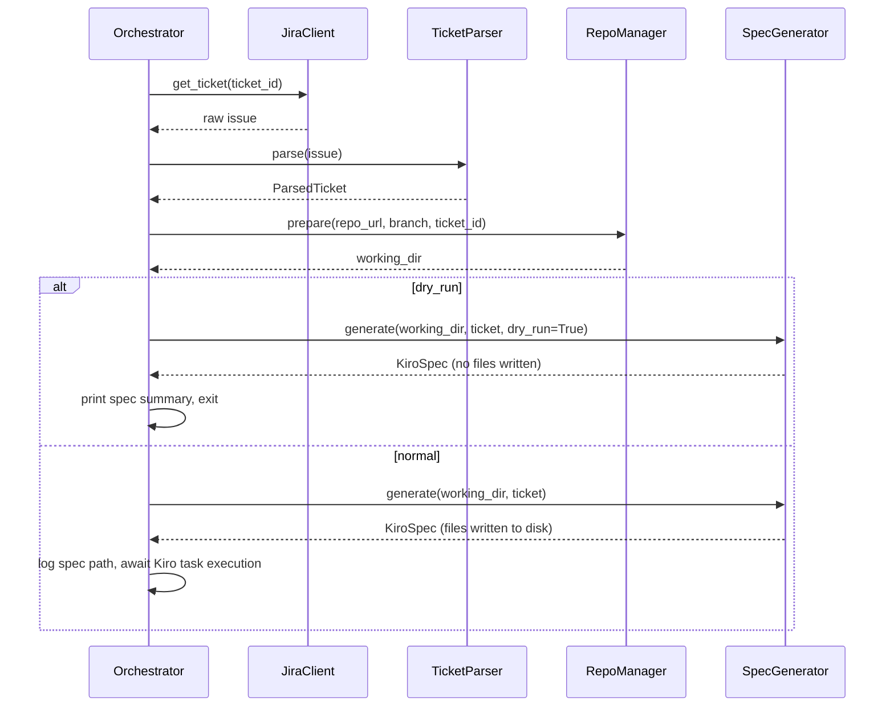

# Design Document: Jira Repo Automation

## Overview

The Jira Repo Automation tool is a Python CLI application that bridges Jira issue tracking and GitLab source control. Given a Jira ticket ID, it:

1. Fetches the ticket from the Jira REST API
2. Extracts the target repository URL and branch from custom fields
3. Clones or fetches the repository locally
4. Creates a feature branch named after the ticket ID
5. Generates a Kiro spec (requirements.md, design.md, tasks.md) from the ticket content and writes it into the cloned repo's `.kiro/specs/<ticket-id>/` directory
6. Kiro's task execution engine (running in the IDE) autonomously reads the spec and applies the code changes
7. A post-task hook detects task completion and triggers the git commit and push of the feature branch

The tool is designed to be run from the command line, in CI/CD pipelines, or as a scheduled job. It supports a dry-run mode for safe previewing and structured logging for observability. Crucially, **no external LLM API calls are made by the tool itself** — all code generation is delegated to Kiro running in the IDE via the spec file format.

### Key Design Decisions

- **Kiro spec file generation** is used for code modification. The tool writes a structured `.kiro/specs/<ticket-id>/` directory containing `requirements.md`, `design.md`, and `tasks.md` derived from the Jira ticket content. Kiro's task execution engine reads these files and autonomously applies the changes. This avoids subprocess invocation, external API keys, and re-implementing code generation logic.
- **Post-task hook** handles the git commit and push. A Kiro hook (configured in `.kiro/hooks/`) fires after task execution completes and invokes the tool's commit-and-push logic, keeping the automation loop closed without developer intervention.
- **GitPython** is used for all Git operations (clone, fetch, branch, commit, push) to avoid shell injection risks and provide a clean Python API.
- **`jira` (jira-python)** is used for Jira REST API access, supporting both cloud (API token) and server/data center (PAT) authentication.
- **`python-dotenv`** is used to load configuration from a `.env` file, with environment variables taking precedence.
- **`hypothesis`** is used for property-based testing.

---

## Architecture

The tool follows a pipeline architecture with five discrete stages, each implemented as a separate component. A top-level `Orchestrator` drives the pipeline and handles cross-cutting concerns (logging, dry-run, error propagation).



### Component Responsibilities

| Component | Responsibility |
|---|---|
| `ConfigLoader` | Reads and merges credentials from env vars and config file |
| `JiraClient` | Authenticates with Jira, fetches ticket details |
| `TicketParser` | Extracts repo URL, branch, and change description from ticket |
| `RepoManager` | Clones/fetches repo, manages branches, commits, pushes |
| `SpecGenerator` | Generates Kiro spec files (requirements.md, design.md, tasks.md) from ticket content and writes them into the repo |
| `Orchestrator` | Drives the pipeline, handles dry-run and logging |
| Post-Task Hook | Kiro hook that fires after task execution and triggers commit and push |

### Directory Layout

```
jira_repo_automation/
    __init__.py
    main.py              # CLI entry point (argparse)
    orchestrator.py      # Pipeline driver
    config.py            # ConfigLoader + Config dataclass
    jira_client.py       # JiraClient
    ticket_parser.py     # TicketParser + ParsedTicket
    repo_manager.py      # RepoManager
    spec_generator.py    # SpecGenerator + KiroSpec
    exceptions.py        # All custom exception types
    logging_setup.py     # Structured logging configuration
tests/
    test_config.py
    test_jira_client.py
    test_ticket_parser.py
    test_repo_manager.py
    test_spec_generator.py
    test_orchestrator.py
    properties/
        test_ticket_parser_props.py
        test_repo_manager_props.py
        test_spec_generator_props.py
        test_config_props.py
        test_jira_client_props.py
        test_logging_props.py
pyproject.toml
.env.example
```

---

## Components and Interfaces

### ConfigLoader

Loads configuration from environment variables and an optional config file (`.env` or YAML). Environment variables always take precedence over config file values.

```python
@dataclass
class Config:
    # Jira
    jira_base_url: str
    jira_username: str
    jira_api_token: str
    # Git
    git_ssh_key_path: str | None
    git_pat: str | None
    # Tool behaviour
    working_dir_base: str = "/tmp/jira-repo-automation"
    log_format: str = "text"   # "text" | "json"
    verbose: bool = False
    dry_run: bool = False

class ConfigLoader:
    def load(self, config_file: str | None = None) -> Config:
        """Load and merge config. Raises ConfigError if required credentials are absent."""
```

Required environment variables:

| Variable | Purpose |
|---|---|
| `JIRA_BASE_URL` | Jira instance base URL |
| `JIRA_USERNAME` | Jira username / email |
| `JIRA_API_TOKEN` | Jira API token |
| `GIT_SSH_KEY_PATH` or `GIT_PAT` | At least one Git credential |

### JiraClient

Wraps the `jira` library. Authenticates on construction and exposes a single `get_ticket` method.

```python
class JiraClient:
    def __init__(self, config: Config) -> None: ...

    def get_ticket(self, ticket_id: str) -> jira.Issue:
        """Fetch a Jira issue. Raises JiraAuthError, JiraTicketNotFoundError,
        or JiraConnectionError on failure."""
```

Authentication uses HTTP Basic with `(username, api_token)` for Jira Cloud, or token auth for Jira Server/Data Center.

### TicketParser

Pure parsing logic — no I/O. Extracts structured data from a raw `jira.Issue` object.

```python
@dataclass
class ParsedTicket:
    ticket_id: str
    repo_url: str          # extracted from "git url" custom field
    branch: str            # extracted from "branch" custom field
    summary: str
    description: str

class TicketParser:
    GIT_URL_PREFIX = "gitlab repository - "
    BRANCH_PREFIX = "branch - "

    def parse(self, issue: jira.Issue) -> ParsedTicket:
        """Extract structured fields. Raises TicketParseError on missing/malformed fields."""
```

Parsing rules:
- `git url` field value must start with `"gitlab repository - "`. The URL is everything after this prefix.
- `branch` field value must start with `"branch - "`. The branch name is everything after this prefix.
- Both fields are stripped of leading/trailing whitespace after prefix removal.

### RepoManager

Manages all Git operations using GitPython. Accepts a `Config` for credential setup.

```python
class RepoManager:
    def __init__(self, config: Config) -> None: ...

    def prepare(self, repo_url: str, branch: str, ticket_id: str) -> Path:
        """Clone or fetch, checkout branch, create feature branch.
        Returns the working directory path."""

    def commit_and_push(self, working_dir: Path, change_set: ChangeSet,
                        ticket_id: str, summary: str) -> None:
        """Stage all changed files, commit with ticket ID + summary, push feature branch."""
```

Git credential strategy:
- If `git_ssh_key_path` is set, configure GitPython's `GIT_SSH_COMMAND` env var to use that key.
- If `git_pat` is set, inject the PAT into the remote URL as `https://oauth2:<PAT>@gitlab.com/...`.
- Feature branch name: `ticket_id` (e.g., `PROJ-123`).

### SpecGenerator

Generates a Kiro spec directory from a `ParsedTicket` and writes it into the cloned repository. The spec is structured so that Kiro's task execution engine can autonomously read it and apply the described code changes.

```python
@dataclass
class KiroSpec:
    spec_dir: Path          # absolute path to .kiro/specs/<ticket_id>/ in working_dir
    requirements_path: Path
    design_path: Path
    tasks_path: Path

class SpecGenerator:
    def __init__(self, config: Config) -> None: ...

    def generate(self, working_dir: Path, parsed_ticket: ParsedTicket,
                 dry_run: bool = False) -> KiroSpec:
        """Generate Kiro spec files from ticket content and write them to
        <working_dir>/.kiro/specs/<ticket_id>/. Returns a KiroSpec describing
        the written paths. In dry_run mode, returns the KiroSpec without
        writing any files."""
```

#### Spec File Generation Rules

The `SpecGenerator` creates three files under `<working_dir>/.kiro/specs/<ticket_id>/`:

**`.config.kiro`**
```json
{"specId": "<uuid4>", "workflowType": "requirements-first", "specType": "feature"}
```

**`requirements.md`**
Derived from the ticket's `summary` and `description` fields. The generator formats the description as a single requirement with the ticket summary as the user story and the description body as the acceptance criteria. Structured EARS-style criteria are extracted where the description contains `WHEN`/`THEN`/`IF`/`SHALL` patterns; otherwise the full description is included verbatim as a single acceptance criterion.

**`tasks.md`**
A task list derived from the requirements. Each acceptance criterion becomes one or more tasks. The generator produces a flat, numbered task list in the format Kiro's task execution engine expects:

```markdown
# Tasks

- [ ] 1. <action derived from acceptance criterion 1>
- [ ] 2. <action derived from acceptance criterion 2>
...
```

**`design.md`**
A minimal design stub that provides Kiro with the working directory context and the ticket ID, so the task execution engine knows where to apply changes:

```markdown
# Design: <ticket_id> — <summary>

## Overview

Apply changes described in Jira ticket <ticket_id> to the repository at `<working_dir>`.

## Context

- **Ticket ID**: <ticket_id>
- **Repository**: <repo_url>
- **Branch**: <branch>
- **Summary**: <summary>

## Change Description

<description>
```

#### Kiro Integration

Once the spec files are written, the tool's responsibility ends. Kiro's task execution engine (running in the IDE) detects the new spec directory, reads the tasks, and autonomously applies the code changes to the working directory. No subprocess is spawned and no external API key is required.

The `SpecGenerator` records the spec directory path so the post-task hook can locate it after Kiro finishes.

### Orchestrator

Drives the full pipeline. Handles dry-run short-circuiting and top-level error handling.

```python
class Orchestrator:
    def __init__(self, config: Config) -> None: ...

    def run(self, ticket_id: str) -> None:
        """Execute the full pipeline for the given ticket ID."""
```

Pipeline sequence:



After `SpecGenerator.generate` returns in normal mode, the Orchestrator logs the spec directory path and exits. The commit-and-push step is handled by the post-task hook (see [Post-Task Hook](#post-task-hook)) once Kiro finishes executing the tasks.

---

## Data Models

### ParsedTicket

```python
@dataclass
class ParsedTicket:
    ticket_id: str       # e.g. "PROJ-123"
    repo_url: str        # e.g. "https://gitlab.com/org/repo"
    branch: str          # e.g. "main"
    summary: str         # Jira ticket summary line
    description: str     # Jira ticket description body
```

### KiroSpec

```python
@dataclass
class KiroSpec:
    spec_dir: Path          # e.g. <working_dir>/.kiro/specs/PROJ-123/
    requirements_path: Path # spec_dir / "requirements.md"
    design_path: Path       # spec_dir / "design.md"
    tasks_path: Path        # spec_dir / "tasks.md"
    config_path: Path       # spec_dir / ".config.kiro"
```

### Config

See ConfigLoader section above.

### Exception Hierarchy

```
AutomationError (base)
    ConfigError              # missing/invalid configuration
    JiraAuthError            # 401/403 from Jira API
    JiraTicketNotFoundError  # 404 from Jira API
    JiraConnectionError      # network failure reaching Jira
    TicketParseError         # missing/malformed custom fields
    RepoError                # git clone/fetch/push failures
    BranchNotFoundError      # target branch absent on remote
    PushConflictError        # non-fast-forward push rejection
    SpecGenerationError      # failure writing spec files to disk
    EmptyChangeSetError      # no changes after Kiro task execution
```

---

## Post-Task Hook

The post-task hook closes the automation loop by committing and pushing the feature branch after Kiro finishes executing the spec tasks. It is configured as a Kiro `postTaskExecution` hook in the repository's `.kiro/hooks/` directory.

### Hook Configuration

The hook is written to `<working_dir>/.kiro/hooks/commit-and-push.json` by the `SpecGenerator` alongside the spec files:

```json
{
  "id": "jira-commit-and-push",
  "name": "Commit and Push Feature Branch",
  "description": "After Kiro task execution completes, stage all changes, commit with the ticket ID and summary, and push the feature branch to the remote.",
  "eventType": "postTaskExecution",
  "hookAction": "runCommand",
  "command": "python -m jira_repo_automation.hooks.commit_and_push --spec-dir .kiro/specs/<ticket_id> --working-dir .",
  "timeout": 120
}
```

### Hook Behaviour

The `commit_and_push` hook script:

1. Reads the ticket ID and summary from the spec's `requirements.md` front-matter (written by `SpecGenerator`).
2. Uses `git diff --name-status HEAD` (via GitPython) to detect all files modified, created, or deleted by Kiro's task execution.
3. Builds a `ChangeSet` from the diff output.
4. If the `ChangeSet` is empty, raises `EmptyChangeSetError` and exits non-zero (no empty commit is created).
5. Stages all changed files and creates a commit with the message: `<ticket_id>: <summary>`.
6. Pushes the feature branch to the remote.
7. If the push is rejected (non-fast-forward), raises `PushConflictError` and exits non-zero without force-pushing.

### Dry-Run Behaviour

When the tool is invoked with `--dry-run`, `SpecGenerator.generate` does not write any files, so no hook is registered and no commit or push occurs.

---

## Correctness Properties

*A property is a characteristic or behavior that should hold true across all valid executions of a system — essentially, a formal statement about what the system should do. Properties serve as the bridge between human-readable specifications and machine-verifiable correctness guarantees.*

### Property 1: Ticket-not-found error contains the ticket ID

*For any* ticket ID string, when the Jira API returns a 404 response, the raised `JiraTicketNotFoundError` message should contain that exact ticket ID.

**Validates: Requirements 1.4**

---

### Property 2: Connection error contains the endpoint URL

*For any* Jira base URL, when the Jira API is unreachable (network error or non-2xx status), the raised `JiraConnectionError` message should contain that URL.

**Validates: Requirements 1.5**

---

### Property 3: Git URL field parsing is a round trip

*For any* valid GitLab repository URL, wrapping it in the `"gitlab repository - <url>"` format and passing it through `TicketParser` should return the original URL unchanged.

**Validates: Requirements 2.1**

---

### Property 4: Branch field parsing is a round trip

*For any* valid branch name string, wrapping it in the `"branch - <name>"` format and passing it through `TicketParser` should return the original branch name unchanged.

**Validates: Requirements 2.2**

---

### Property 5: Change description preserves summary and description

*For any* non-empty summary string and description string, the `ParsedTicket` produced by `TicketParser.parse` should contain both the original summary and the original description.

**Validates: Requirements 2.3**

---

### Property 6: Malformed git URL field raises error with field name and ticket ID

*For any* string that does not start with `"gitlab repository - "` (including the empty string and None), and *for any* ticket ID, `TicketParser.parse` should raise a `TicketParseError` whose message contains both the field name (`"git url"`) and the ticket ID.

**Validates: Requirements 2.4**

---

### Property 7: Malformed branch field raises error with field name and ticket ID

*For any* string that does not start with `"branch - "` (including the empty string and None), and *for any* ticket ID, `TicketParser.parse` should raise a `TicketParseError` whose message contains both the field name (`"branch"`) and the ticket ID.

**Validates: Requirements 2.5**

---

### Property 8: Checkout is called with the exact branch name

*For any* branch name string, when `RepoManager.prepare` is called with that branch name, the underlying git checkout operation should be invoked with that exact branch name.

**Validates: Requirements 3.3**

---

### Property 9: Feature branch is named after the ticket ID

*For any* ticket ID string, the feature branch created by `RepoManager.prepare` should have a name equal to that ticket ID.

**Validates: Requirements 3.4**

---

### Property 10: Repository error contains the repo URL

*For any* repository URL, when a git operation (clone, fetch, or push) fails, the raised `RepoError` message should contain that URL.

**Validates: Requirements 3.5, 3.6**

---

### Property 11: Spec directory is created under the working directory

*For any* working directory path and ticket ID, `SpecGenerator.generate` should create the spec directory at `<working_dir>/.kiro/specs/<ticket_id>/`.

**Validates: Requirements 4.1**

---

### Property 12: Spec files contain the ticket summary and description

*For any* non-empty summary string and description string, the `requirements.md` and `design.md` files written by `SpecGenerator.generate` should each contain both the original summary and the original description.

**Validates: Requirements 4.1, 4.2**

---

### Property 13: Tasks file contains at least one task per acceptance criterion

*For any* ticket description that contains at least one acceptance criterion, the `tasks.md` file written by `SpecGenerator.generate` should contain at least one task entry.

**Validates: Requirements 4.1**

---

### Property 14: Spec generation error contains the target file path

*For any* file path that cannot be written (e.g. permission denied), when `SpecGenerator.generate` attempts to write that file, the raised `SpecGenerationError` message should contain that file path.

**Validates: Requirements 4.4**

---

### Property 15: Spec files are not written in dry-run mode

*For any* working directory and parsed ticket, when `SpecGenerator.generate` is called with `dry_run=True`, no files should be written to the filesystem and the returned `KiroSpec` paths should not exist on disk.

**Validates: Requirements 8.1, 8.3**

---

### Property 16: All change set files are staged before commit

*For any* non-empty `ChangeSet`, `RepoManager.commit_and_push` should stage every file path in the change set before creating the commit.

**Validates: Requirements 5.1**

---

### Property 17: Commit message contains ticket ID and summary

*For any* ticket ID string and ticket summary string, the commit message produced by `RepoManager.commit_and_push` should contain both the ticket ID and the summary.

**Validates: Requirements 5.2**

---

### Property 18: Env var takes precedence over config file value

*For any* configuration key, when the same key is present in both the config file and as an environment variable, `ConfigLoader.load` should return the environment variable value.

**Validates: Requirements 6.3**

---

### Property 19: Missing credential error contains the credential name

*For any* required credential name that is absent from both environment variables and the config file, `ConfigLoader.load` should raise a `ConfigError` whose message contains that credential name.

**Validates: Requirements 6.4**

---

### Property 20: Error log entry contains operation name, error message, and ticket ID

*For any* operation name string, error message string, and ticket ID string, when an error is logged, the resulting ERROR-level log entry should contain all three values.

**Validates: Requirements 7.2**

---

## Error Handling

Each component raises typed exceptions from the `AutomationError` hierarchy. The `Orchestrator` catches all `AutomationError` subclasses, logs them at ERROR level with the ticket ID, and exits with a non-zero status code. Unexpected exceptions propagate and produce a stack trace.

| Scenario | Exception | Logged fields |
|---|---|---|
| Missing credential | `ConfigError` | credential name |
| Jira auth failure | `JiraAuthError` | credential type, HTTP status |
| Ticket not found | `JiraTicketNotFoundError` | ticket ID |
| Jira unreachable | `JiraConnectionError` | endpoint URL, error detail |
| Malformed custom field | `TicketParseError` | field name, ticket ID |
| Git clone/fetch failure | `RepoError` | repo URL, git error output |
| Branch not found | `BranchNotFoundError` | branch name, repo URL |
| Push conflict | `PushConflictError` | branch name, repo URL |
| Spec file write failure | `SpecGenerationError` | file path |
| Empty change set | `EmptyChangeSetError` | ticket ID |

### Non-Force-Push Policy

When a push is rejected with a non-fast-forward error, the tool raises `PushConflictError` and exits. It never force-pushes automatically. The user must resolve the conflict manually and re-run, or pass an explicit `--force-push` flag (which must be added as a future requirement if needed).

---

## Testing Strategy

### Dual Testing Approach

Unit tests cover specific examples, edge cases, and error conditions. Property-based tests (using [Hypothesis](https://hypothesis.readthedocs.io/)) verify universal properties across a wide input space. Both are complementary.

### Property-Based Testing

**Library**: `hypothesis` (Python)
**Minimum iterations**: 100 per property (Hypothesis default; increase with `settings(max_examples=200)` for critical properties)
**Tag format**: Each property test is annotated with a comment:

```python
# Feature: jira-repo-automation, Property N: <property text>
```

Properties 3–7 (TicketParser) and 18–19 (ConfigLoader) are pure functions and ideal for PBT. Properties 8–17 involve I/O and use mocks to keep tests fast and deterministic. Properties 11–15 (SpecGenerator) use `tmp_path` for real filesystem writes since they are cheap and deterministic.

### Unit Tests

Focus areas:
- Each exception type is raised in the correct scenario with the correct message content
- Dry-run mode: no filesystem writes, no git commits, no pushes
- Commit message format
- `ChangeSet.summary()` output format
- Log format switching (text vs JSON)
- Verbose/debug log emission

### Integration Tests

A small set of integration tests (3–5) use a real local git repository (created in a temp directory) to verify the end-to-end clone → branch → commit → push flow against a local bare repo. These do not call the real Jira API or Kiro CLI.

### Mocking Strategy

| External dependency | Mock approach |
|---|---|
| Jira REST API | `unittest.mock.patch` on `jira.JIRA` |
| Kiro spec file writes | `tmp_path` pytest fixture for real temp dirs |
| GitPython repo operations | `unittest.mock.patch` on `git.Repo` methods |
| Filesystem | `tmp_path` pytest fixture for real temp dirs |
