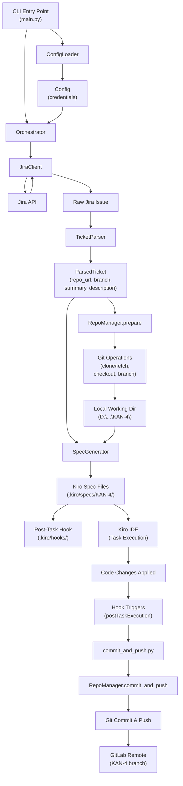
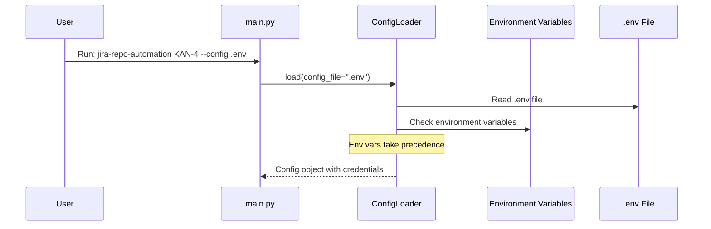
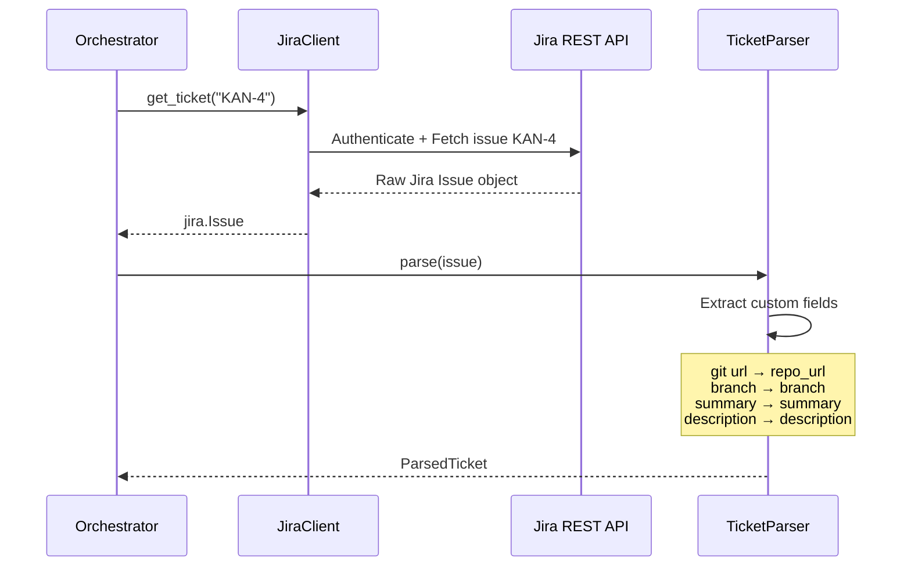
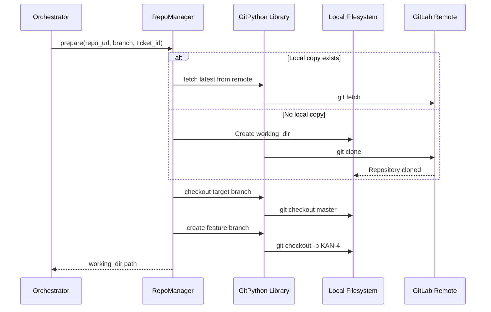
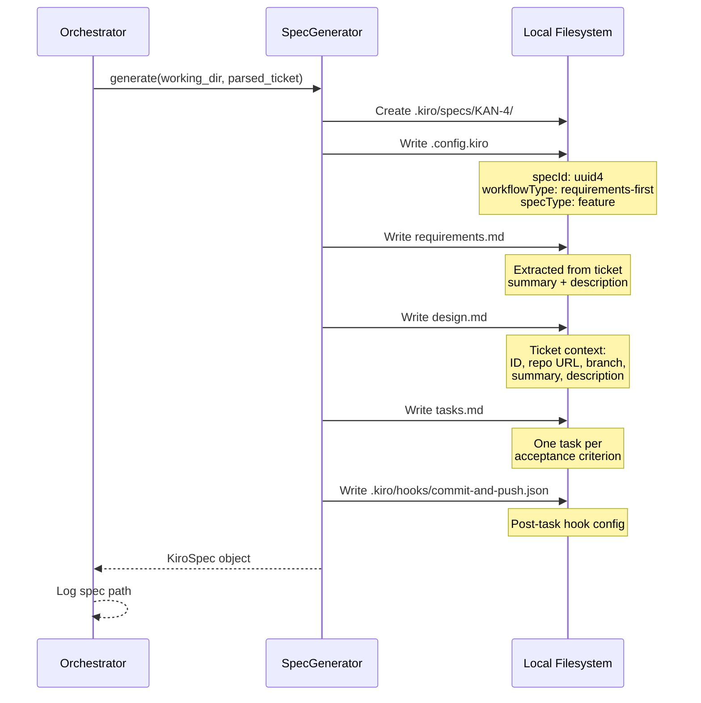
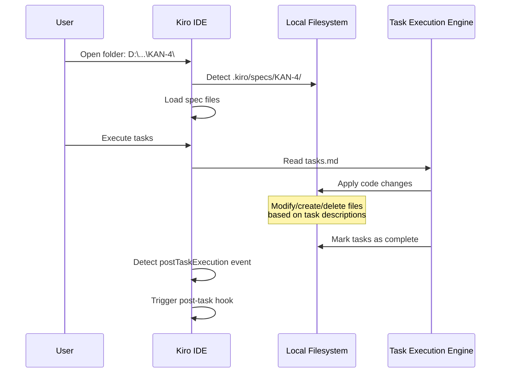
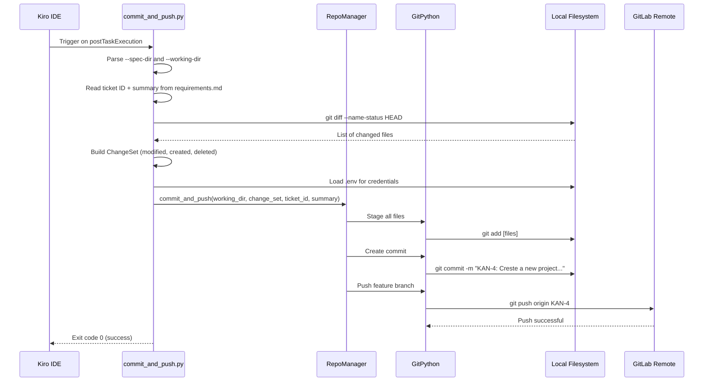

# Jira Repo Automation

A Python CLI tool that automates the entire workflow from Jira ticket to code changes to git push. It fetches a Jira ticket, clones the target repository, generates a Kiro spec from the ticket content, and automatically commits and pushes changes once Kiro finishes executing the spec tasks.

## Proof of Concept

- **GitLab Repository:** https://gitlab.com/treeleafworm-group/treeleafworm-project
- **Jira Project:** https://treeleafworm.atlassian.net/jira/software/projects/KAN/boards/2?selectedIssue=KAN-4
- **Example Ticket:** KAN-4 — "Create a new project in node which sends email to people in env file"

## Overview

This tool bridges Jira issue tracking and GitLab source control by creating a fully automated pipeline:

1. **Fetch** — Pull ticket details from Jira
2. **Parse** — Extract repository URL and branch from custom fields
3. **Clone** — Clone/fetch the target repository locally
4. **Generate** — Create a Kiro spec from the ticket content
5. **Execute** — Kiro reads the spec and applies code changes (in the IDE)
6. **Commit & Push** — Automatically commit and push changes via a post-task hook

## Architecture



## Detailed Process Flow

### Phase 1: Configuration & Credential Loading



**Required Credentials:**
- `JIRA_BASE_URL` — Your Jira instance URL
- `JIRA_USERNAME` — Jira username/email
- `JIRA_API_TOKEN` — Jira API token
- `GIT_PAT` or `GIT_SSH_KEY_PATH` — At least one Git credential

---

### Phase 2: Jira Ticket Fetching



**Error Handling:**
- `JiraAuthError` — 401/403 authentication failure
- `JiraTicketNotFoundError` — 404 ticket not found
- `JiraConnectionError` — Network failure or unreachable API

---

### Phase 3: Repository Preparation



**Working Directory:** `D:\Others\MainProjs\pullnupshpulls\KAN-4\`

**Error Handling:**
- `RepoError` — Clone/fetch failure
- `BranchNotFoundError` — Target branch not found on remote

---

### Phase 4: Kiro Spec Generation



**Generated Files:**
```
D:\Others\MainProjs\pullnupshpulls\KAN-4\
├── .kiro/
│   ├── specs/
│   │   └── KAN-4/
│   │       ├── .config.kiro
│   │       ├── requirements.md
│   │       ├── design.md
│   │       └── tasks.md
│   └── hooks/
│       └── commit-and-push.json
├── .env (copied automatically)
└── [repository files]
```

---

### Phase 5: Kiro Task Execution (IDE)



**What Kiro Does:**
- Reads the spec files from `.kiro/specs/KAN-4/`
- Interprets the requirements and design
- Autonomously applies code changes to the repository
- Marks tasks as complete

---

### Phase 6: Automatic Commit & Push (Post-Task Hook)



**Commit Message Format:** `<TICKET_ID>: <TICKET_SUMMARY>`

Example: `KAN-4: Creste a new project in node which sends email to people in env file`

**Error Handling:**
- `EmptyChangeSetError` — No files changed (exit code 1)
- `PushConflictError` — Non-fast-forward rejection (exit code 1, no force-push)

---

## End-to-End Workflow

```mermaid
graph LR
    A["1. Run CLI<br/>jira-repo-automation KAN-4"] --> B["2. Fetch Jira Ticket"]
    B --> C["3. Parse Ticket<br/>(extract repo, branch)"]
    C --> D["4. Clone/Fetch Repo"]
    D --> E["5. Generate Kiro Spec"]
    E --> F["6. Open in Kiro IDE"]
    F --> G["7. Execute Tasks<br/>(Kiro applies changes)"]
    G --> H["8. Hook Fires<br/>(postTaskExecution)"]
    H --> I["9. Commit Changes"]
    I --> J["10. Push to GitLab<br/>(KAN-4 branch)"]
    J --> K["✓ Done<br/>Create MR in GitLab"]
    
    style A fill:#e1f5ff
    style B fill:#e1f5ff
    style C fill:#e1f5ff
    style D fill:#e1f5ff
    style E fill:#e1f5ff
    style F fill:#fff3e0
    style G fill:#fff3e0
    style H fill:#f3e5f5
    style I fill:#f3e5f5
    style J fill:#f3e5f5
    style K fill:#c8e6c9
```



---

## Installation & Setup

### 1. Install Dependencies

```bash
pip install -e .
```

### 2. Create `.env` File

```bash
cp .env.example .env
```

Fill in your credentials:

```
JIRA_BASE_URL=https://treeleafworm.atlassian.net
JIRA_USERNAME=your-email@example.com
JIRA_API_TOKEN=your-api-token
GIT_PAT=your-gitlab-pat
WORKING_DIR_BASE=D:\Others\MainProjs\pullnupshpulls
```

### 3. Configure Jira Custom Fields

On your Jira ticket (e.g., KAN-4), add two custom fields:

| Field Name | Value |
|---|---|
| `git url` | `https://gitlab.com/your-org/your-repo` |
| `branch` | `main` |

---

## Usage

### Dry Run (Preview)

```bash
python -m jira_repo_automation.main KAN-4 --config .env --dry-run
```

Shows what would happen without cloning or writing files.

### Full Run

```bash
python -m jira_repo_automation.main KAN-4 --config .env
```

Clones repo, generates spec, and waits for Kiro task execution.

### With Verbose Logging

```bash
python -m jira_repo_automation.main KAN-4 --config .env --verbose
```

Emits DEBUG-level logs for troubleshooting.

### JSON Logs

```bash
python -m jira_repo_automation.main KAN-4 --config .env --log-format json
```

Outputs structured JSON logs for log aggregation systems.

---

## Component Details

### ConfigLoader (`config.py`)

Reads credentials from environment variables and `.env` file. Environment variables always take precedence.

**Raises:** `ConfigError` if any required credential is missing.

### JiraClient (`jira_client.py`)

Authenticates with Jira REST API and fetches issue details.

**Error Mapping:**
- 401/403 → `JiraAuthError`
- 404 → `JiraTicketNotFoundError`
- Network failure → `JiraConnectionError`

### TicketParser (`ticket_parser.py`)

Extracts structured data from raw Jira issue:
- `repo_url` from `git url` custom field
- `branch` from `branch` custom field
- `summary` and `description` from standard fields

**Raises:** `TicketParseError` if fields are missing or malformed.

### RepoManager (`repo_manager.py`)

Manages all Git operations:
- Clone or fetch repository
- Checkout target branch
- Create feature branch
- Stage, commit, and push changes

**Supports:**
- SSH authentication (via `GIT_SSH_KEY_PATH`)
- HTTPS with PAT (via `GIT_PAT`)

### SpecGenerator (`spec_generator.py`)

Generates Kiro spec files from ticket content:
- `.config.kiro` — Spec metadata
- `requirements.md` — Requirements extracted from ticket
- `design.md` — Design stub with ticket context
- `tasks.md` — Task list from acceptance criteria
- `commit-and-push.json` — Post-task hook configuration

**Dry-Run Mode:** Returns spec paths without writing files.

### Orchestrator (`orchestrator.py`)

Drives the full pipeline:
1. Load config
2. Fetch Jira ticket
3. Parse ticket
4. Prepare repository
5. Generate Kiro spec
6. Copy `.env` to working directory
7. Log spec path and exit

**Error Handling:** Catches all `AutomationError` subclasses, logs at ERROR level, and exits with code 1.

### Post-Task Hook (`hooks/commit_and_push.py`)

Triggered by Kiro after task execution completes:
1. Extract ticket ID and summary from spec
2. Detect changed files via `git diff`
3. Build `ChangeSet`
4. Load credentials from `.env`
5. Stage, commit, and push changes

**Exit Codes:**
- 0 — Success
- 1 — Configuration error, empty change set, or push conflict

---

## Exception Hierarchy

```
AutomationError (base)
├── ConfigError
├── JiraAuthError
├── JiraTicketNotFoundError
├── JiraConnectionError
├── TicketParseError
├── RepoError
│   ├── BranchNotFoundError
│   └── PushConflictError
├── SpecGenerationError
└── EmptyChangeSetError
```

All exceptions include descriptive error messages with relevant context (ticket ID, field name, URL, etc.).

---

## Logging

The tool emits structured logs at each major step:

```
2026-05-05T05:24:24Z  INFO  jira_repo_automation.orchestrator  Starting pipeline  [ticket_id=KAN-4]
2026-05-05T05:24:24Z  INFO  jira_repo_automation.jira_client  Fetching Jira ticket  [ticket_id=KAN-4]
2026-05-05T05:24:25Z  INFO  jira_repo_automation.ticket_parser  Ticket parsed successfully  [ticket_id=KAN-4]
2026-05-05T05:24:25Z  INFO  jira_repo_automation.repo_manager  Repository prepared  [working_dir=D:\...]
2026-05-05T05:24:25Z  INFO  jira_repo_automation.spec_generator  Kiro spec generated  [spec_dir=D:\...]
```

**Log Formats:**
- **Text** (default) — Human-readable with key=value pairs
- **JSON** — Structured for log aggregation systems

**Log Levels:**
- **INFO** — Major operations (default)
- **DEBUG** — Detailed operations (with `--verbose`)
- **ERROR** — Failures with context

---

## Troubleshooting

### "Missing required field 'git url'"

**Cause:** The custom field `git url` is not set on the Jira ticket or is empty.

**Solution:** Add the `git url` custom field to your Jira ticket with the repository URL.

### "Branch not found on remote"

**Cause:** The target branch doesn't exist on the GitLab remote.

**Solution:** Verify the branch name in the Jira ticket's `branch` custom field.

### "Push rejected (non-fast-forward)"

**Cause:** Someone else pushed to the same branch while you were working.

**Solution:** Manually resolve the conflict and re-run the tool.

### "Configuration error: Missing required credential"

**Cause:** A required environment variable is not set.

**Solution:** Check your `.env` file and ensure all required credentials are present.

### Hook doesn't trigger

**Cause:** The `.env` file is not in the working directory.

**Solution:** The tool now copies `.env` automatically. If it still fails, manually copy it:
```bash
copy D:\Others\MainProjs\pullnupsh\.env D:\Others\MainProjs\pullnupshpulls\KAN-4\.env
```

---

## Project Structure

```
jira_repo_automation/
├── __init__.py
├── main.py                 # CLI entry point
├── orchestrator.py         # Pipeline driver
├── config.py               # Configuration loading
├── jira_client.py          # Jira API client
├── ticket_parser.py        # Ticket parsing
├── repo_manager.py         # Git operations
├── spec_generator.py       # Kiro spec generation
├── exceptions.py           # Exception hierarchy
├── logging_setup.py        # Structured logging
└── hooks/
    ├── __init__.py
    └── commit_and_push.py  # Post-task hook script

tests/
├── test_config.py
├── test_jira_client.py
├── test_ticket_parser.py
├── test_repo_manager.py
├── test_spec_generator.py
├── test_orchestrator.py
└── properties/
    ├── test_config_props.py
    ├── test_jira_client_props.py
    ├── test_ticket_parser_props.py
    ├── test_repo_manager_props.py
    ├── test_spec_generator_props.py
    └── test_logging_props.py

pyproject.toml
.env.example
README.md
```

---

## Dependencies

- **jira** (3.8.0) — Jira REST API client
- **GitPython** (3.1.43) — Git operations
- **python-dotenv** (1.0.1) — Environment variable loading
- **hypothesis** (6.131.15) — Property-based testing
- **pytest** (8.3.5) — Unit testing

---

## License

This project is part of the Jira Repo Automation suite.

---

## Summary

This tool automates the entire workflow from Jira ticket to git push:

1. **Fetch** ticket from Jira
2. **Parse** repository and branch details
3. **Clone/fetch** the target repository
4. **Generate** a Kiro spec from ticket content
5. **Execute** tasks in Kiro IDE (code changes applied)
6. **Commit & push** changes automatically via post-task hook

The entire process is fully automated — once you run the CLI and execute the Kiro tasks, the changes are automatically committed and pushed to GitLab.
