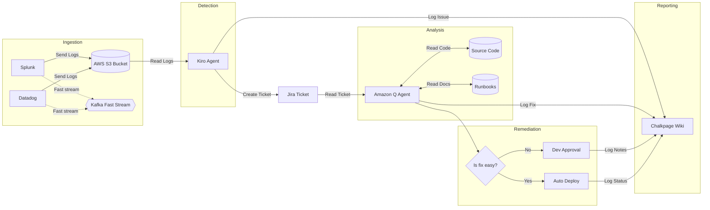

# Reference Architecture: AI-Driven ITSM Pipeline

## 1. Executive Summary

This document outlines a fully automated, agentic IT Service Management (ITSM) workflow. By integrating **Kiro** (Observability Agent) and **Amazon Q** (Remediation Agent), this architecture transitions our operations from manual ticket triaging to automated, code-aware remediation and documentation.

## 2. Architecture Diagram

